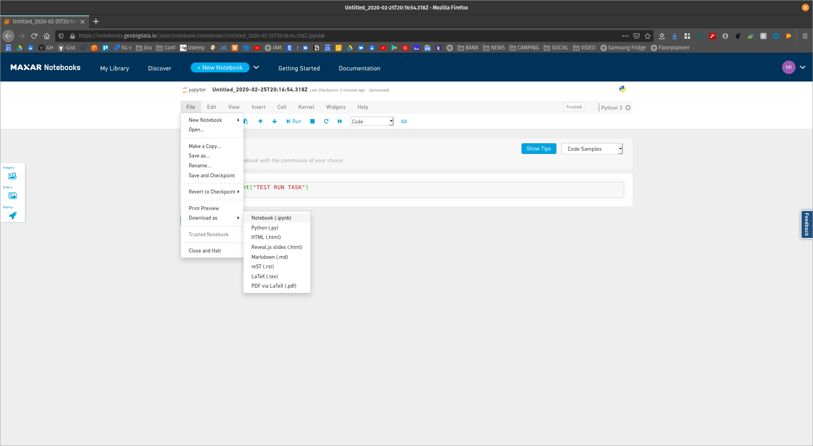
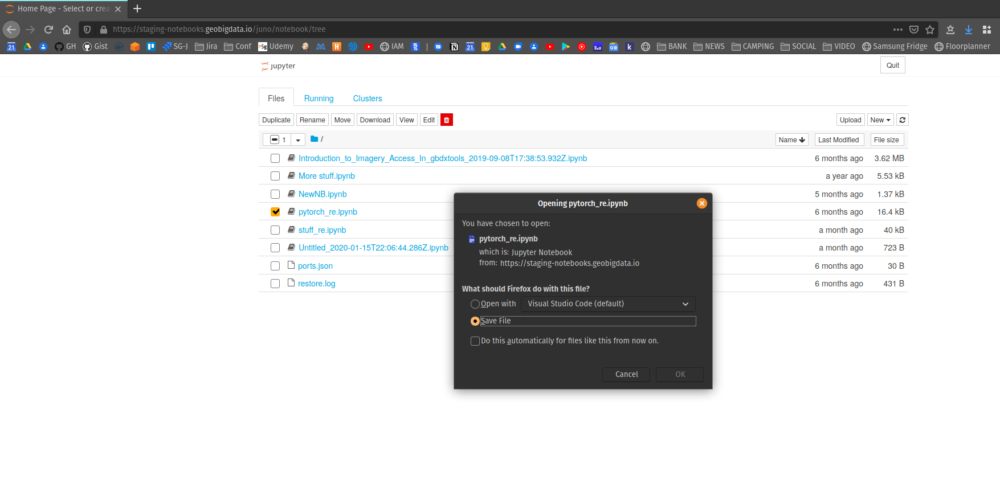

# Manual Task Deploy to Notebooks on GBDX

This process is for those who want to deploy their jupyter notebooks as GBDX tasks.

It is recommened to use GBDXtools for convenience, but the same work can be done by hitting the GBDX endpoints. For documentation on GBDXtools including install, see [here](https://gbdxtools.readthedocs.io/en/latest/).

For reference on how to create tasks and submit workflows, please see the [GBDX task and workflow](https://gbdxdocs.digitalglobe.com/docs/task-and-workflow-course) documentation.

The other requirements are having Docker installed, and a DockerHub account where images can be pushed before they are registered on the GBDX platform.

## Export Files

In order to build the image, first the notebook file and the conda env file need to be exported. The easiest way to do this is to save it from the Notebooks UI.

There are a couple ways to download the notebook file. First from the `File -> Download as` menu item in the notebook page, as seen below:



The second options is from the [Jupyter tree](https://notebooks.geobigdata.io/juno/notebook/tree#), as seen below:



It should be noted that task files should be isolated from other files to keep the task image small and avoid any unintended side effects. See the build section for more details.

## Build Image

There is reference to the base image and it's dependencies in the `base-image/` directory. This base image can be used to build task images from. The root [Dockerfile](./Dockerfile) shows what is required for building and running a notebook. This image can be modified to suit the task.

To build an image run the following:

```
docker build --file=Dockerfile --tag <myorg>/<myimage>:<mytag> --build-arg NOTEBOOK_NAME=<mynotebook>.ipynb .
```

It should be noted that the build context at the end (`.`) will add all the files in your current working directory into the image. This can bloat the image and cause problems. It is recommended to create a new directory for each task, that will only contain the `*.ipynb` and the `requirements.yml` files (and any other files required by the notebook).

## Push Image


## Register Task


## Submit Workflow


## Get Results
